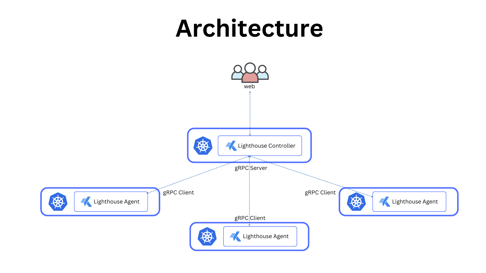

# Lighthouse
Lighthouse is an opensource Multi-Cluster Kubernetes Dashboard. It is lightweight, easy to install and designed to simplify Kubernetes management across multiple clusters.

Lighthouse provides a unified interface to manage and interact with multiple Kubernetes clusters. Whether you're working with vanilla Kubernetes, managed services like EKS /GKE / AKS / OKE / DOKS, or lightweight distributions like K3s, Lighthouse has you covered.

## Key Features

- **Multi-Cluster Management**: Manage multiple Kubernetes clusters from a single dashboard.
- **Role and Attribute-Based Access Control (RBAC/ABAC)**: Granular user permissions to Kubernetes components, ensuring secure and controlled access.
- **Lightweight**: Minimal resource footprint, making it easy to deploy and run.
- **Extensible**: Compatible with a wide range of Kubernetes distributions.
- **User-Friendly**: Intuitive web interface for performing Kubernetes tasks.

## Components
- Controller
- Agent
- Frontend

### Controller
Controller is the heart of lighthouse consisting of a http server to serve the APIs and a gRPC server to serve the agents. Controller manages all the agents across different cluster and communicates with them to perform different kubernetes actions. 

### Agent
An Agent runs in each cluster and connects to the central controller through gRPC. Agent performs all the Kubernetes actions triggered by a user in it's cluster.

### Frontend
Frontend is the Kubernetes Dashboard webapp through which user can interact and perform different Kubernetes tasks in different Kubernetes clusters.

## Architecture

## Compatibility
Lighthouse works with most of your favorite Kubernetes flavor
- Vanilla Kubernetes
- K3s
- EKS
- GKE
- AKS
- OKE
- DOKS
- Kind
- Minikube
- Many more

## Getting Started

### Installation
To install Lighthouse, follow the [Installation Guide](https://github.com/krack8/helm-charts/tree/main/charts/lighthouse).

## Contributing

We welcome contributions! If you'd like to contribute to Lighthouse, please:
1. Fork the repository.
2. Create a new branch for your feature or bugfix.
3. Submit a pull request.

For more details, refer to the [Development Guide](docs/dev.md).